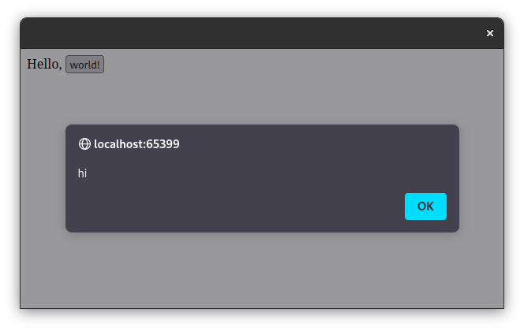

# Overview

Bindings for [webui](https://github.com/webui-dev/webui).

```lisp
(let ((w (webui-new-window)))
  (webui-bind w "my-button"
              (lambda (event)
                (declare (ignore event))
                (webui-run w "alert(\"hi\");")))
  (webui-show w "<html>
                   <script src=\"webui.js\"></script>
                   Hello,
                   <button id=\"my-button\">world!</button>
                 </html>")
  (webui-wait))
```



# Setup

I installed webui like this on Linux:

```bash
git clone https://github.com/webui-dev/webui
cd webui/
make
cp dist/webui-2.so /usr/lib/webui-2.so
```

Feel free to contribute ways to load webui for Mac or Windows.
